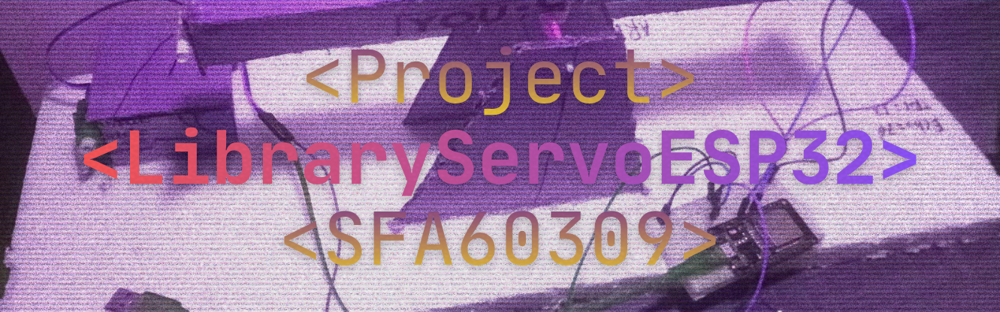

# Library Servo ESP32

library ini ditanam pada sistem ball beam menggunakan microcotroller esp32.Sistem mendeteksi jika bola tidak ditengah makan servo akan menggerekan papan untuk menyeimbangkan bola agar tepat ditengah.

